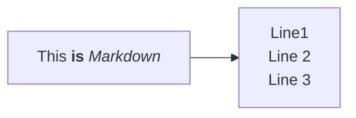

# Sample

1. sample 1

```mermaid
flowchart LR
    markdown["`This **is** _Markdown_`"]
    newLines["`Line1
    Line 2
    Line 3`"]
    markdown --> newLines
```

2. sample 2

```mermaid
flowchart LR
    markdown["`This **is** _Markdown_`"]
    newLines["`Line1\nLine 2\nLine 3`"]
    markdown --> newLines
```

3. sample 3

```mermaid
flowchart LR
    markdown["`This **is** _Markdown_`"]
    newLines["`Line1\\nLine 2\\nLine 3`"]
    markdown --> newLines
```
